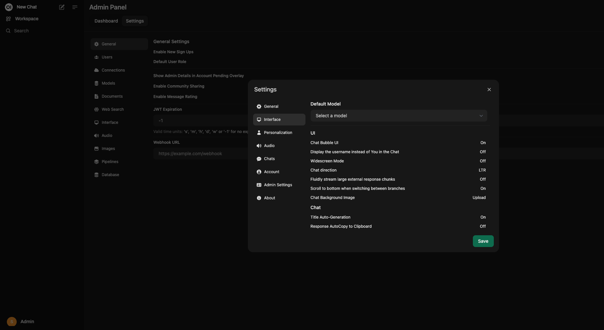
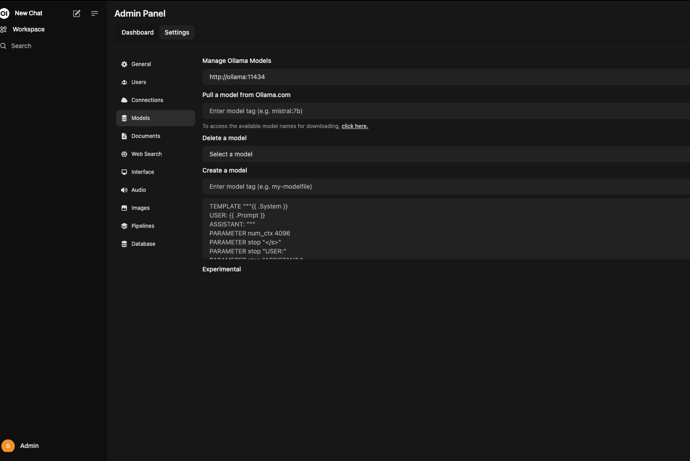
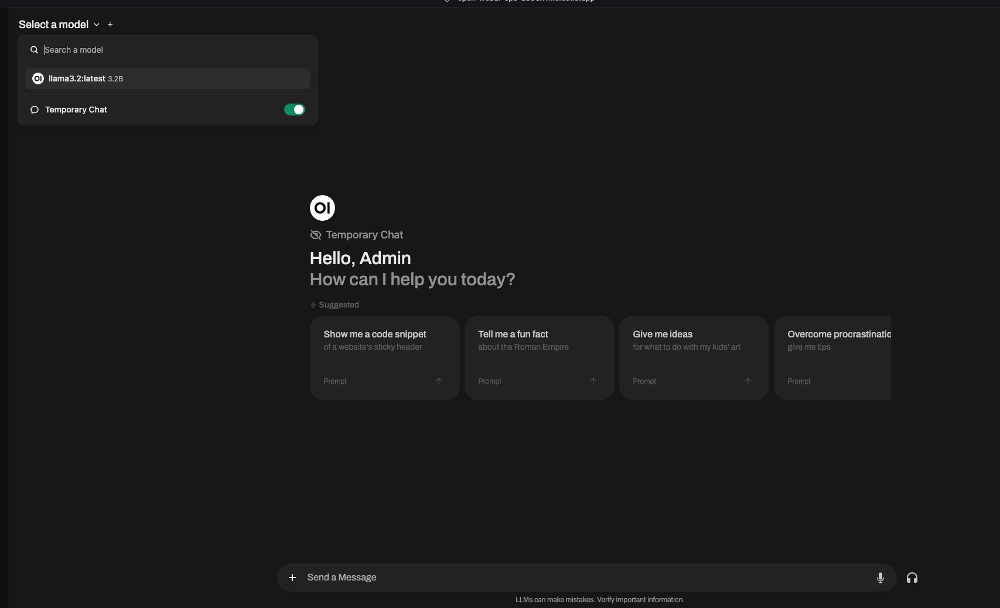

# Open WebUI CI/CD pipeline

Deploy Open WebUI with CI/CD on Elestio

 
 

# Once deployed ...

You can open Open WebUI Registry here:

    URL: https://[CI_CD_DOMAIN]
    login: [ADMIN_EMAIL]
    password: [ADMIN_PASSWORD]

## About Software

**Open WebUI** is an extensible, feature-rich, and user-friendly self-hosted WebUI designed to operate entirely offline. It supports various LLM runners, including Ollama and OpenAI-compatible APIs.

## How to use it ?

After Login, In the sidebar, on the bottom left, click your profile icon. From there, select `settings` and then `admin settings`. 

Go to models on the `Admin Panel dashboard`. Under models, add the names of the Olama models you want to use. You can view the list of Olama models here: https://ollama.com/library.

Once the model has downloaded successfully, navigate to open-webui chat and choose the desired model you want to use.

